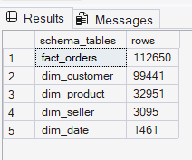
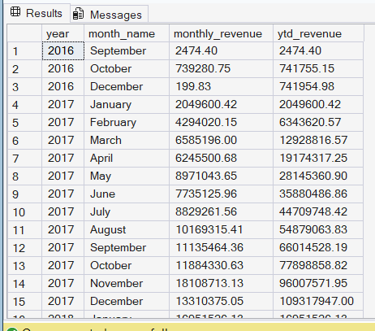
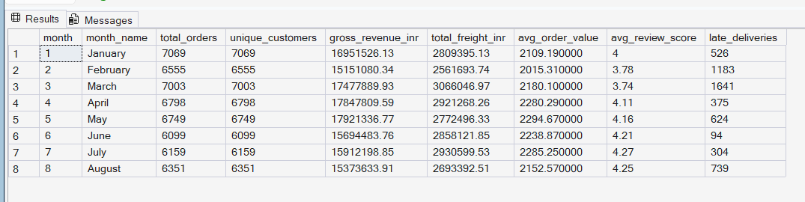
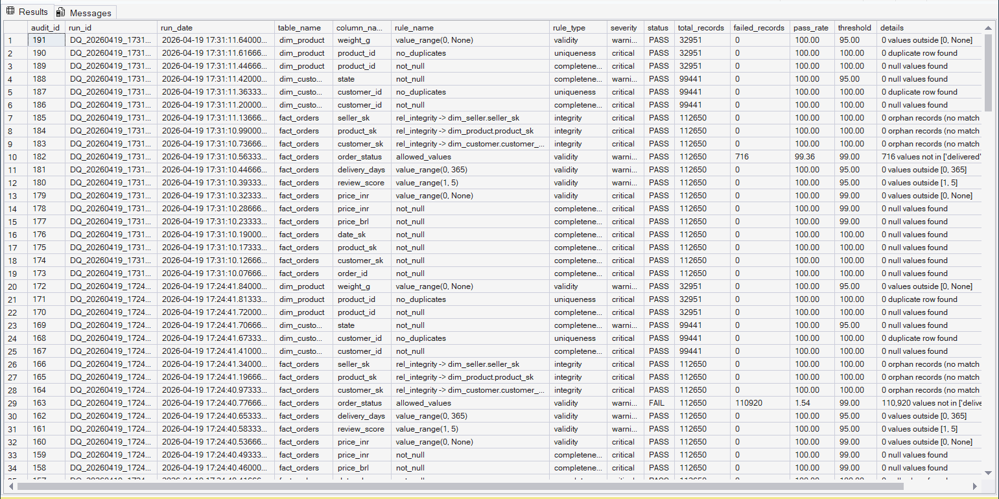
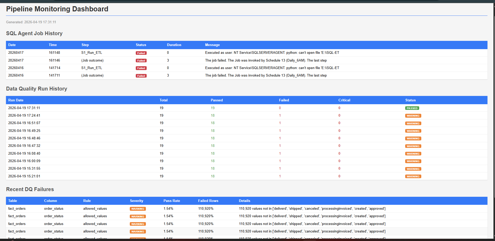
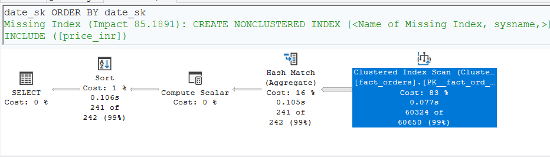
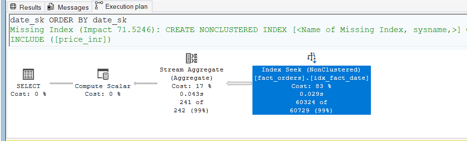

# E-Commerce SQL Analytics Platform
**Tech Stack:** Python 3.13 · SQL Server 2025 Developer Edition · T-SQL · pyodbc · Pandas · REST API

---

## What This Project Is

A production-grade SQL analytics platform built on **112,650 real e-commerce transactions** from the Brazilian Olist dataset (Kaggle). Combines a live currency conversion API, a star schema data warehouse, 20+ advanced T-SQL analytical queries, an automated data quality framework, SQL Server Agent scheduling, and an HTML monitoring dashboard.

This is not a tutorial project. Every component was designed, broken, debugged, and documented independently.

---

## Architecture

```
Data Sources
├── Kaggle: Brazilian E-Commerce Dataset (7 CSV files, 112K+ rows)
└── ExchangeRate API: Live BRL → INR conversion rate

          │
          ▼
ETL Pipeline (etl_pipeline.py)
├── Fetch live BRL→INR rate via REST API
├── Load 7 CSVs into staging tables (TRUNCATE → LOAD)
├── Build dim_date (2016–2019, every day)
├── Load dim_customer, dim_product, dim_seller
└── Load fact_orders (star schema joins + currency conversion)

          │
          ▼
SQL Server Star Schema (Ecommerce_Analytics)
├── fact_orders     — 112,650 rows (core fact table)
├── dim_customer    —  99,441 rows
├── dim_product     —  32,951 rows
├── dim_seller      —   3,095 rows
└── dim_date        —   1,461 rows (4 years)

          │
          ▼
Data Quality Framework (dq_framework.py)
├── 19 rule checks across 4 tables
├── Rules: not_null, no_duplicates, value_range,
│         allowed_values, referential_integrity
├── Results logged to dq_audit table
└── Run summary saved to dq_run_summary table

          │
          ▼
SQL Analytics (sql/analytics_queries.sql)
├── Window functions: running totals, LAG, RANK, NTILE, DENSE_RANK
├── CTEs: multi-level aggregations, revenue contribution
├── Stored Procedures: monthly revenue, seller performance,
│                      customer segmentation
├── Views: daily sales summary
└── Query optimization: execution plans + index benchmarks

          │
          ▼
Monitoring Dashboard (monitoring_dashboard.py)
├── Queries SQL Server Agent job history (msdb system tables)
├── Reads DQ run results from dq_run_summary + dq_audit
└── Generates HTML report with job status + DQ failures
```

---

## Dataset

**Brazilian E-Commerce Public Dataset by Olist**
Source: kaggle.com/datasets/olistbr/brazilian-ecommerce
Records: 99,441 orders · 112,650 order items · 2016–2018

| File | Rows | Purpose |
|---|---|---|
| olist_orders_dataset.csv | 99,441 | Order headers |
| olist_order_items_dataset.csv | 112,650 | Line items → fact base |
| olist_customers_dataset.csv | 99,441 | Customer dimension |
| olist_products_dataset.csv | 32,951 | Product dimension |
| olist_sellers_dataset.csv | 3,095 | Seller dimension |
| olist_order_payments_dataset.csv | 103,886 | Payment details |
| olist_order_reviews_dataset.csv | 99,224 | Review scores |

---

## SQL Objects Created

| Object | Type | Purpose |
|---|---|---|
| `fact_orders` | Fact Table | Core analytics table — 112,650 rows |
| `dim_customer` | Dimension | Customer data |
| `dim_product` | Dimension | Product + category data |
| `dim_seller` | Dimension | Seller location data |
| `dim_date` | Dimension | Full date spine 2016–2019 |
| `stg_*` (7 tables) | Staging | Raw CSV landing zone |
| `dq_audit` | Audit | DQ rule check results |
| `dq_run_summary` | Audit | One row per DQ pipeline run |
| `usp_MonthlyRevenue` | Stored Proc | Revenue by month for any year |
| `usp_SellerPerformance` | Stored Proc | Top N sellers with metrics |
| `usp_CustomerSegmentation` | Stored Proc | VIP/Loyal/Returning/One-Time |
| `vw_daily_sales` | View | Pre-aggregated daily metrics |
| `ix_fact_*` (4 indexes) | Index | Performance tuning |

---

## Key SQL Concepts Demonstrated

**Window Functions**
- Running YTD revenue using `SUM() OVER (ROWS UNBOUNDED PRECEDING)`
- Seller ranking within state using `RANK() OVER (PARTITION BY)`
- Month-over-month growth using `LAG()`
- Top 3 products per category using `DENSE_RANK()`
- Customer order frequency buckets using `NTILE(4)`

**CTEs**
- Multi-level revenue aggregations
- Late delivery rate by seller state
- Above-average customer spend identification
- Revenue contribution % with cumulative running total

**Query Optimization**
- Execution plan analysis before/after index creation
- Covering index with INCLUDE columns
- Eliminating function-on-column anti-pattern
- Documented before/after query execution times

**Data Quality Framework**
- 19 configurable rule checks across 4 tables
- Rule types: completeness, uniqueness, validity, integrity
- Threshold-based PASS/FAIL with severity levels
- Full audit trail in dq_audit table

---

## DQ Run Results (Latest)

```
Run ID:  DQ_20260419_152100
Status:  WARNING
Total:   19 checks
Passed:  18
Failed:  1  → fact_orders.order_status [allowed_values]
             1.54% pass rate (threshold: 99%)
             Real finding: dataset contains status values
             not in the expected allowed list
Critical: 0
```

---

## Project Structure

```
E-Commerce SQL Analytics Platform/
│
├── data/                              ← Kaggle CSV files (7 files)
│
├── sql/
│   ├── 01_ecom_schema_setup.sql       ← full DB + table creation
│   ├── 02_analytics_queries.sql       ← 20+ analytical queries
│   ├── 03_dq_check_monitor.sql        ← stored procedure + data quality check
│   ├── 04_SQL_Agent_Job_Setup.sql     ← sql agent to automate task (Scheduling + Monitoring)
│   └── 05_mail_setup.sql              ← mail alert for SQL Agennt
│
├── logs/                              ← pipeline + DQ run logs
│
├── reports/                           ← generated HTML dashboards
│
├── screenshots/
│   ├── 01_star_schema_ssms.png
│   ├── 02_window_functions_result.png
│   ├── 03_stored_procedure_output.png
│   ├── 04_dq_audit_results.png
│   ├── 05_monitoring_dashboard.png
│   └── 06_execution_plan_comparison.png
│
├── etl_pipeline.py                    ← main ETL (API + CSV → SQL)
├── dq_framework.py                    ← data quality engine
├── monitoring_dashboard.py            ← HTML report + Agent history
├── dq_runner.py                       ← master orchestrator
├── requirements.txt
├── migration_issues_log.md
└── README.md
```

---

## How to Run

**1. Prerequisites**
- SQL Server 2025 Developer Edition
- Python 3.11+
- Free API key from exchangerate-api.com
- Kaggle dataset downloaded to `data/`

**2. Install dependencies**
```bash
pip install pandas pyodbc requests
```

**3. Create database schema**
```sql
-- Open SSMS → run:
sql/01_schema_setup.sql
```

**4. Add your API key**
```python
# In etl_pipeline.py, line ~15:
API_KEY = 'your_key_here'
```

**5. Run ETL pipeline**
```bash
python etl_pipeline.py
```

**6. Run full pipeline with DQ + monitoring**
```bash
python dq_runner.py
```

**7. Run analytics queries**
```sql
-- Open SSMS → run:
sql/02_analytics_queries.sql
```

---

## Sample Pipeline Output

```
INFO | E-Commerce ETL Pipeline — 2026-04-19 14:30:00
INFO | Live exchange rate: 1 BRL = 18.43 INR
INFO | Loading olist_orders_dataset.csv... 99,441 rows
INFO | Loading olist_order_items_dataset.csv... 112,650 rows
INFO | Loading olist_customers_dataset.csv... 99,441 rows
INFO | Loading dim_date... 1,461 rows
INFO | Loading dim_customer... 99,441 rows
INFO | Loading dim_product... 32,951 rows
INFO | Loading fact_orders... 112,650 rows
INFO | Pipeline completed successfully

INFO | Data Quality Run: DQ_20260419_152100
INFO | DQ Checker: fact_orders (112,650 rows)
INFO | [PASS] fact_orders.order_id [not_null] 100.0%
INFO | [PASS] fact_orders.customer_sk [not_null] 100.0%
INFO | [FAIL] fact_orders.order_status [allowed_values] 1.54%
INFO | Total: 19 | Pass: 18 | Fail: 1 | Overall: WARNING
```

---

## Screenshots

### Star Schema in SSMS


### Window Functions — Month-over-Month Growth


### Stored Procedure — Monthly Revenue Report


### DQ Audit Results


### Monitoring Dashboard (HTML)


### Execution Plan — Before vs After Index



---

## Interview Q&A

**Q: Walk me through your star schema design.**
The fact table is fact_orders — one row per order line item,
containing surrogate keys to 4 dimensions (customer, product,
seller, date) plus measures (price in BRL and INR, freight,
review score, delivery days). Dimensions are kept narrow —
only descriptive attributes, no measures. The date dimension
is a full spine covering all dates in the range, which prevents
missing-month issues in time-series queries.

**Q: What is the difference between RANK and DENSE_RANK?**
RANK skips numbers after ties — if two sellers tie for rank 1,
the next rank is 3. DENSE_RANK does not skip — the next rank
after a tie is 2. In my seller performance query I used RANK
because I wanted gaps to be visible when sellers had identical
revenue — it makes ties obvious in the output.

**Q: How do you handle missing months in time-series analysis?**
In my month-over-month growth query, months with zero delivered
orders were absent from the CTE — causing LAG to compare
non-consecutive months and produce distorted growth percentages.
I fixed it by left-joining from dim_date as the base, ensuring
every month appears in the result with zero revenue when no
orders existed. This is standard practice for any time-series
query on sparse data.

**Q: How do you ensure data quality in your pipelines?**
I built a reusable DataQualityChecker class that runs configurable
rule-based checks against any table — null rates, duplicate
detection, value range validation, allowed values enforcement,
and referential integrity. Every check result is logged to a
dq_audit table with pass rate, threshold, and failure details.
A run summary table tracks overall status per run. In my latest
run the framework caught that 1.54% of order_status values were
not in the expected allowed list — a real data quality finding
from the Kaggle dataset.

**Q: What is a covering index?**
A covering index includes all columns needed to satisfy a query
in the index itself — so SQL Server never needs to go back to
the base table. In my execution plan optimization, I added
ix_fact_date with INCLUDE (price_inr, order_status) — the
query engine resolved the entire WHERE + SELECT from the index
alone, dropping the cost from a full table scan to an index seek.

---

## Challenges and Solutions

See [migration_issues_log.md](migration_issues_log.md) for all
bugs hit during development with root causes and fixes.